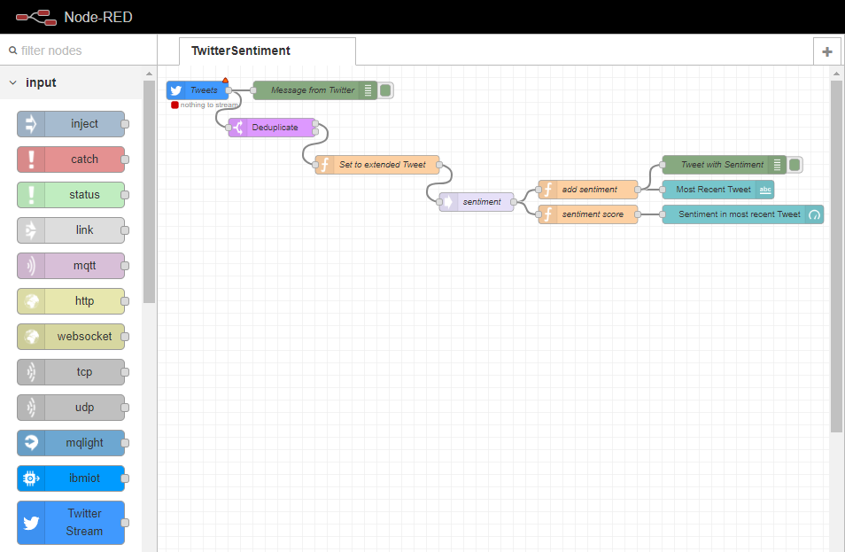
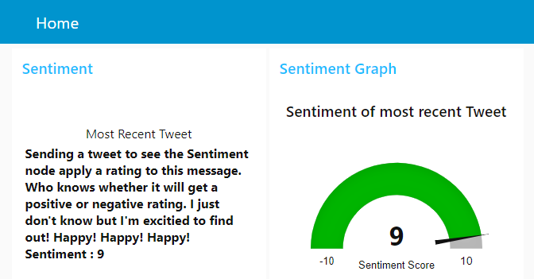

TwitterSentiment
================

### About

This flow provides an example of using the Sentiment analysis node to read Tweets and apply a sentiment rating in real-time. In this example the processed tweet is displayed in a Node-Red Dashboard element alongside a dial indicating the tweets sentiment rating. 

The dashboard is accessible via the existing Node-Red httpRoot path with `/UI` added. On the localhost this would be `http://127.0.0.1:1880/ui`.

**Note:** In order to use the Twitter Stream Node the user will need to sign up for a Twitter developer account and set up a Twitter app. See [Twitter developer apps: Overview](https://developer.twitter.com/en/docs/basics/apps/overview).
